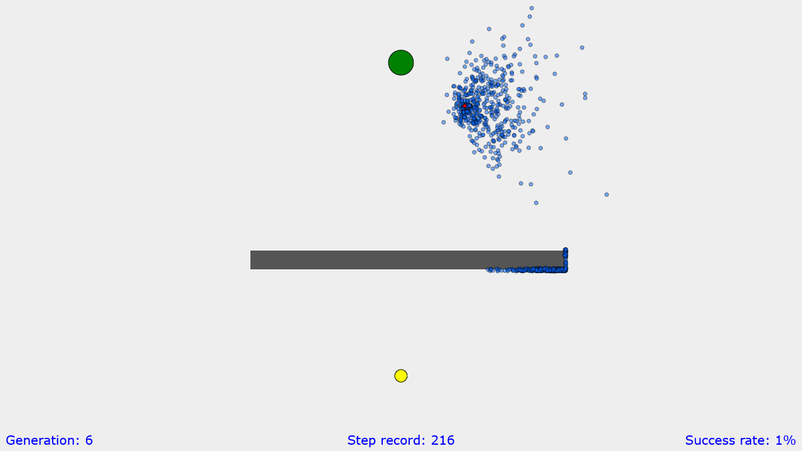

# Evolution of Points

This is a demonstration of an evolutionary algorithm.

Demo: https://rvfr9.codesandbox.io/

The blue points have to learn how to walk from the yellow circle to the green circle. When they reach obstacles like the gray rectangle in the middle, they die. They also die after a certain amount of time. The fittest points (with the least distance to the goal) produce the most offspring, which means that slowly the generation becomes better and better. When they have reached the goal, they also optimize the way to that goal, because the required distance actually also enters the fitness function.

The point with the largest fitness from the previous generation is drawn red. You can hide all other points by pressing the key 'o' (like opacity).

The rectangle class here also deals with moving rectangles: just change the vel-attribute and uncomment the update-function.

This project is inspired by [Code Bullet](https://www.youtube.com/channel/UC0e3QhIYukixgh5VVpKHH9Q/).
